# 🗄️ Restaurant Management System - Database Schema

## Overview

This database schema is designed for a production-ready restaurant management system with:
- Main warehouse + 2 branches
- Supplier management with credit/cash payments
- Inventory tracking with batch/expiry management
- POS system for orders
- Damage and returns management
- Complete audit trail

## Database Support

| File | Database | Status |
|------|----------|--------|
| `sqlite_schema.sql` | SQLite 3.x | ✅ Primary (Development & Production) |
| `schema.sql` | PostgreSQL 14+ | ✅ Ready for Migration |

## SQLite vs PostgreSQL Compatibility

| Feature | SQLite | PostgreSQL |
|---------|--------|------------|
| Primary Keys | TEXT (UUID string) | UUID |
| ENUMs | Lookup Tables | Native ENUM |
| Boolean | INTEGER (0/1) | BOOLEAN |
| DateTime | TEXT (ISO format) | TIMESTAMP WITH TIME ZONE |
| JSON | TEXT | JSONB |
| Auto UUID | hex(randomblob(16)) | uuid_generate_v4() |
| Triggers | Basic | Advanced |
| Generated Columns | Not supported | Supported |

## Tables Summary

| # | Table | Description |
|---|-------|-------------|
| 1 | roles | أدوار المستخدمين |
| 2 | branches | الفروع والمخزن الرئيسي |
| 3 | users | المستخدمين |
| 4 | categories | فئات الأصناف |
| 5 | units | وحدات القياس |
| 6 | items | الأصناف |
| 7 | suppliers | الموردين |
| 8 | supplier_items | ربط الموردين بالأصناف |
| 9 | inventory | المخزون |
| 10 | inventory_batches | دفعات المخزون |
| 11 | supplies | التوريدات |
| 12 | supply_items | تفاصيل التوريدات |
| 13 | supplier_payments | مدفوعات الموردين |
| 14 | transfers | تحويلات المخزون |
| 15 | transfer_items | تفاصيل التحويلات |
| 16 | damage_reasons | أسباب التلف |
| 17 | damages | التالف |
| 18 | supplier_returns | مرتجعات الموردين |
| 19 | menu_categories | فئات المنيو |
| 20 | menu_items | أصناف المنيو |
| 21 | menu_item_ingredients | مكونات المنيو |
| 22 | orders | الأوردرات |
| 23 | order_items | تفاصيل الأوردرات |
| 24 | inventory_transactions | حركات المخزون |
| 25 | daily_inventory_counts | الجرد اليومي |
| 26 | daily_inventory_count_items | تفاصيل الجرد |
| 27 | notifications | الإشعارات |
| 28 | alert_settings | إعدادات التنبيهات |
| 29 | audit_logs | سجل المراجعة |
| 30 | user_sessions | جلسات المستخدمين |
| 31 | system_settings | إعدادات النظام |
| 32 | branch_settings | إعدادات الفروع |


## Entity Relationship Diagram

```mermaid
erDiagram
    %% Core Entities
    ROLES ||--o{ USERS : has
    BRANCHES ||--o{ USERS : employs
    BRANCHES ||--o{ INVENTORY : contains
    BRANCHES ||--o{ ORDERS : receives
    BRANCHES ||--o{ TRANSFERS : from_to
    BRANCHES ||--o{ DAMAGES : has
    
    %% User Relations
    USERS ||--o{ ORDERS : creates
    USERS ||--o{ SUPPLIES : receives
    USERS ||--o{ DAMAGES : registers
    USERS ||--o{ SUPPLIER_RETURNS : registers
    USERS ||--o{ AUDIT_LOGS : generates
    
    %% Item Relations
    CATEGORIES ||--o{ ITEMS : contains
    UNITS ||--o{ ITEMS : measures
    ITEMS ||--o{ INVENTORY : tracked_in
    ITEMS ||--o{ SUPPLY_ITEMS : supplied
    ITEMS ||--o{ TRANSFER_ITEMS : transferred
    ITEMS ||--o{ DAMAGES : damaged
    
    %% Supplier Relations
    SUPPLIERS ||--o{ SUPPLIES : provides
    SUPPLIERS ||--o{ SUPPLIER_PAYMENTS : receives
    SUPPLIERS ||--o{ SUPPLIER_RETURNS : returns_to
    SUPPLIERS ||--o{ SUPPLIER_ITEMS : supplies
    
    %% Supply Chain
    SUPPLIES ||--o{ SUPPLY_ITEMS : contains
    SUPPLIES ||--o{ SUPPLIER_RETURNS : has_returns
    SUPPLIES ||--|| SUPPLIER_PAYMENTS : paid_by
    
    %% Inventory Flow
    INVENTORY ||--o{ INVENTORY_BATCHES : has_batches
    INVENTORY ||--o{ INVENTORY_TRANSACTIONS : logs
    
    %% Transfer Flow
    TRANSFERS ||--o{ TRANSFER_ITEMS : contains
    
    %% Damage Flow
    DAMAGE_REASONS ||--o{ DAMAGES : reason_for
    
    %% Order Flow
    MENU_CATEGORIES ||--o{ MENU_ITEMS : contains
    MENU_ITEMS ||--o{ MENU_ITEM_INGREDIENTS : has
    MENU_ITEMS ||--o{ ORDER_ITEMS : ordered
    ORDERS ||--o{ ORDER_ITEMS : contains
    
    %% Daily Operations
    BRANCHES ||--o{ DAILY_INVENTORY_COUNTS : performs
    DAILY_INVENTORY_COUNTS ||--o{ DAILY_INVENTORY_COUNT_ITEMS : contains
```



## Key Features

### 1. UUID Primary Keys
All tables use UUID for primary keys for:
- Better distribution in distributed systems
- No sequential ID exposure
- Easier data migration

### 2. Soft Deletes via Status
Instead of deleting records, we use status fields:
- `user_status`: active, inactive, suspended
- `supplier_status`: active, inactive
- `item_status`: active, inactive

### 3. Audit Trail
- `audit_logs` table tracks all changes
- `created_at`, `updated_at` on all tables
- `created_by`, `approved_by` for accountability

### 4. Inventory Tracking
- Real-time inventory with `inventory` table
- Batch tracking with `inventory_batches` for FIFO/expiry
- Complete transaction log in `inventory_transactions`

### 5. Automatic Triggers
- Auto-update `updated_at` timestamps
- Auto-update supplier balance on supply/payment/return
- Auto-update inventory on supply/transfer/damage/return
- Auto-create low stock alerts


## Status/Enum Types

In SQLite, we use lookup tables instead of ENUMs for better compatibility:

| Lookup Table | Values | Usage |
|--------------|--------|-------|
| `lookup_user_status` | active, inactive, suspended | User account status |
| `lookup_supplier_status` | active, inactive | Supplier status |
| `lookup_supplier_payment_method` | cash, credit | How supplier is paid |
| `lookup_payment_status` | paid, pending, partial | Supply payment status |
| `lookup_transfer_status` | pending, approved, rejected, received, cancelled | Transfer workflow |
| `lookup_damage_status` | pending, approved, rejected | Damage approval workflow |
| `lookup_return_status` | pending, approved, rejected, received | Return workflow |
| `lookup_order_status` | new, pending_payment, paid, in_kitchen, preparing, ready, delivered, cancelled | Order lifecycle |
| `lookup_order_payment_method` | cash, visa, instapay, wallet | Customer payment |
| `lookup_inventory_operation` | supply, transfer_out, transfer_in, consumption, damage, return, adjustment | Inventory log types |
| `lookup_branch_status` | active, inactive, maintenance | Branch status |
| `lookup_item_status` | active, inactive | Item status |

**Benefits of Lookup Tables:**
- Works in both SQLite and PostgreSQL
- Easy to add new values without schema changes
- Supports Arabic translations
- Can be converted to ENUMs when migrating to PostgreSQL

## Views

| View | Purpose |
|------|---------|
| `v_inventory_status` | Current inventory with stock status |
| `v_supplier_balances` | Supplier balances and statistics |
| `v_daily_sales` | Daily sales summary by branch |
| `v_pending_approvals` | All pending approvals (transfers, damages, returns) |
| `v_expiring_items` | Items expiring within 30 days |

## Installation

### SQLite (Recommended for Development)

```bash
# Create database and run schema
sqlite3 restaurant.db < sqlite_schema.sql

# Or in Python
import sqlite3
conn = sqlite3.connect('restaurant.db')
with open('sqlite_schema.sql', 'r') as f:
    conn.executescript(f.read())
```

### PostgreSQL (For Production Scale)

```bash
# Create database
createdb restaurant_db

# Run schema
psql -d restaurant_db -f schema.sql
```

## Migration from SQLite to PostgreSQL

When ready to migrate:

1. **Export data from SQLite:**
```bash
sqlite3 restaurant.db .dump > data_dump.sql
```

2. **Transform data types:**
   - Convert TEXT UUIDs to UUID type
   - Convert INTEGER booleans to BOOLEAN
   - Convert TEXT dates to TIMESTAMP
   - Replace lookup table references with ENUMs

3. **Run PostgreSQL schema first, then import data**

4. **Use the provided migration script (coming soon)**

## Default Data

The schema includes seed data for:
- 5 default roles (admin, warehouse_manager, branch_supervisor, chef, cashier)
- 12 measurement units
- 7 damage reasons
- Main warehouse branch
- System settings

## Constraints Summary

### Primary Keys
- All tables use UUID primary keys

### Foreign Keys
- All relationships enforced with FK constraints
- `ON DELETE RESTRICT` for critical data
- `ON DELETE CASCADE` for child records
- `ON DELETE SET NULL` for optional references

### Unique Constraints
- `users.username`, `users.email`
- `items.code`, `items.barcode`
- `suppliers.code`
- `branches.code`
- All number fields (order_number, supply_number, etc.)
- Composite: `inventory(branch_id, item_id)`

### Check Constraints
- Quantities must be >= 0
- Prices must be >= 0
- Percentages between 0-100
- Email format validation
- Phone format validation
- Date logic (expiry > production)

## Performance Indexes

- All foreign keys indexed
- Composite indexes for common queries
- Partial indexes for active records
- Full-text search indexes for Arabic names

## Security Considerations

1. Passwords stored as hashes only
2. Session management with expiry
3. Failed login tracking with lockout
4. Complete audit logging
5. Role-based access control ready
