# 📋 تقرير فهم نظام إدارة المطعم
## Restaurant Management System - Understanding Report

---

## 🎯 نظرة عامة على النظام (System Overview)

### الهيكل العام

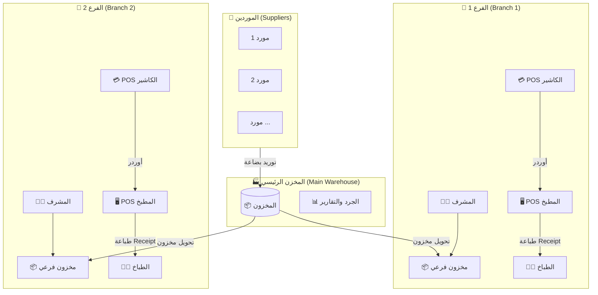

**الشرح:**
- النظام يتكون من 3 أجزاء رئيسية: المخزن الرئيسي + فرعين للبيع
- الموردين بيوردوا للمخزن الرئيسي فقط
- المخزن الرئيسي بيحول البضاعة للفروع حسب الطلب
- كل فرع مستقل في عملياته اليومية

---

## 🚚 نظام الموردين (Suppliers System)

### تدفق عملية التوريد

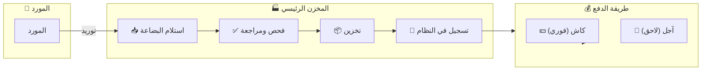

**الشرح:**
- المورد بيجي بالبضاعة للمخزن الرئيسي
- بيتم استلام وفحص البضاعة
- بيتم تخزينها وتسجيلها في النظام
- الدفع إما كاش (فوري) أو آجل (يتسجل كدين على المطعم)

### حالات الدفع للموردين

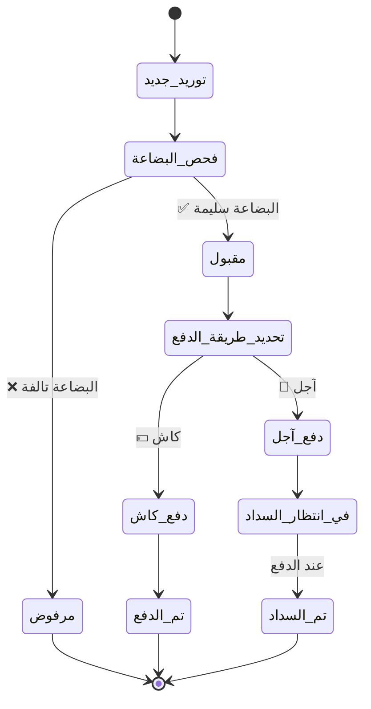

**الشرح:**
- كل توريد بيمر بمراحل: استلام ← فحص ← قبول/رفض ← دفع
- لو كاش: بيتسجل كمدفوع فوراً
- لو آجل: بيفضل في حالة "انتظار السداد" لحد ما يتدفع

---

## 🏭 المخزن الرئيسي (Main Warehouse)

### عمليات المخزن الرئيسي

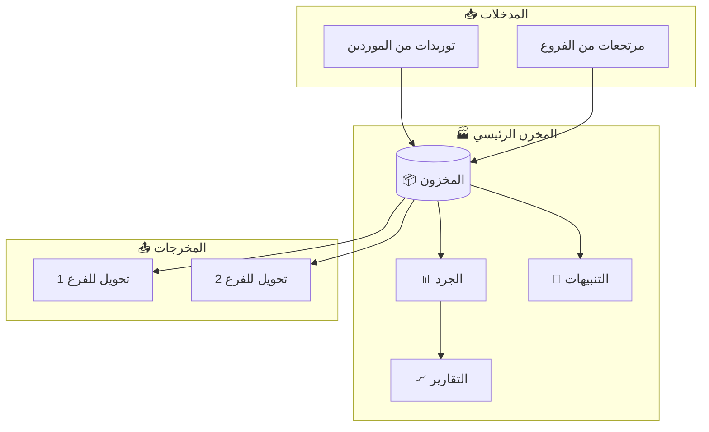

**الشرح:**
- المخزن الرئيسي بيستقبل البضاعة من الموردين
- بيتم عمل جرد دوري للمخزون
- بيتم إنشاء تقارير شاملة
- نظام تنبيهات لما المخزون يقل عن حد معين
- بيتم تحويل البضاعة للفروع حسب طلباتهم

### نظام التنبيهات

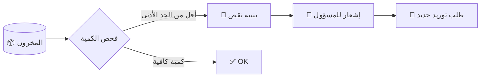

**الشرح:**

- النظام بيراقب كميات المخزون باستمرار
- لما صنف يوصل للحد الأدنى، بيطلع تنبيه
- المسؤول بياخد إشعار ويطلب توريد جديد

---

### 🗑️ نظام التالف (Damaged/Spoiled Items)

#### تدفق تسجيل التالف

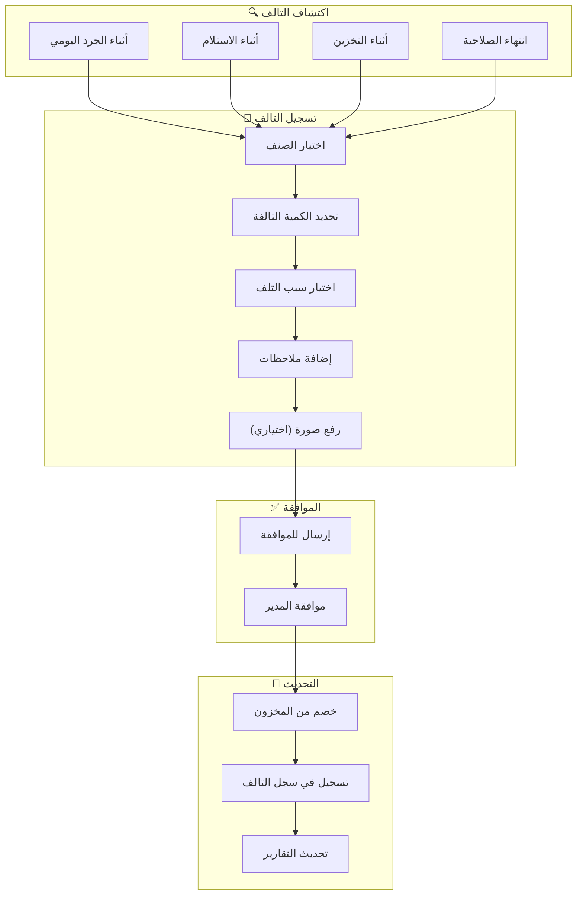

**الشرح:**

- التالف ممكن يتكتشف في أي وقت (جرد، استلام، تخزين، انتهاء صلاحية)
- بيتم تسجيل الصنف والكمية والسبب
- كل تسجيل تالف لازم يتم الموافقة عليه من المدير المسؤول
- بعد الموافقة بيتم خصم الكمية من المخزون وتسجيلها في سجل التالف

#### أسباب التلف

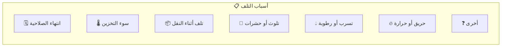

#### حالات التالف

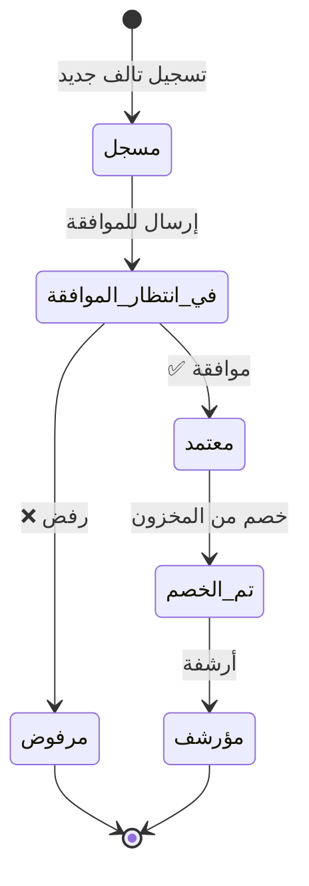

#### التالف في المخزن الرئيسي vs الفرعي

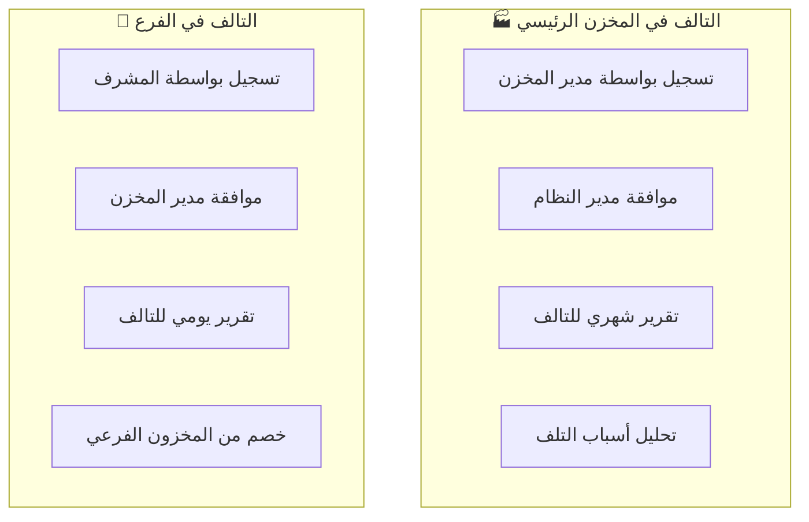

**الشرح:**

**المخزن الرئيسي:**

- مدير المخزن هو المسؤول عن تسجيل التالف
- كل تالف يحتاج موافقة مدير النظام
- تقارير شهرية لتحليل أسباب التلف

**الفروع:**

- المشرف هو المسؤول عن تسجيل التالف
- كل تالف يحتاج موافقة مدير المخزن الرئيسي
- تقارير يومية للتالف مع الجرد

#### سيناريو تسجيل تالف

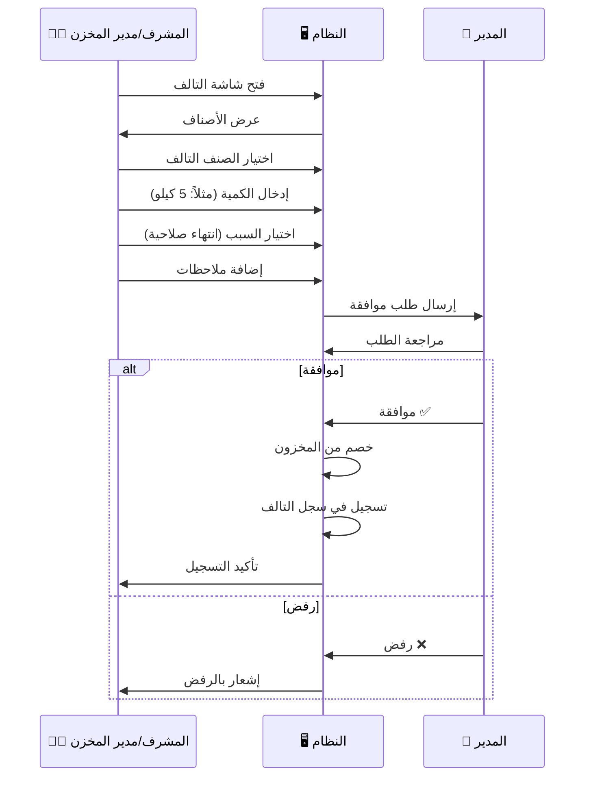

---

### 🔙 نظام المرتجعات للموردين (Supplier Returns)

#### تدفق عملية الإرجاع للمورد

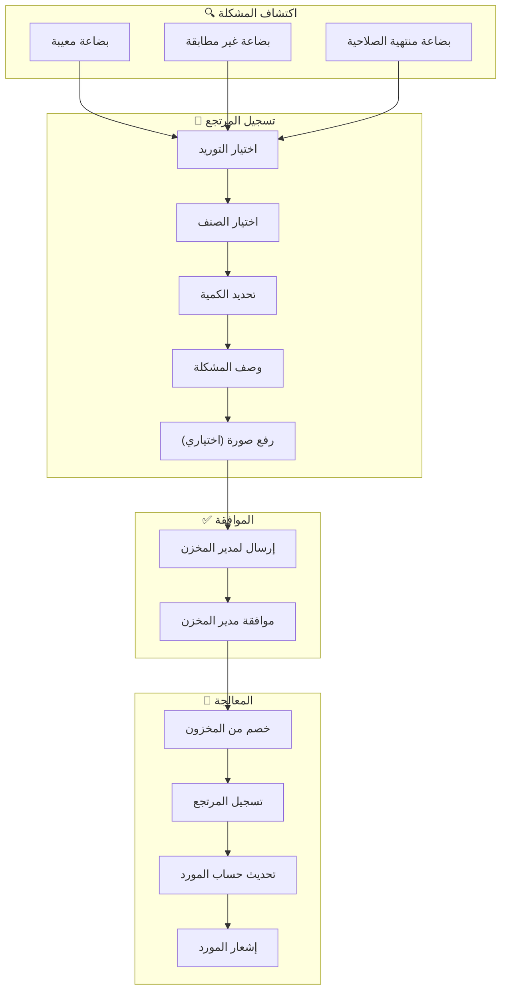

**الشرح:**

- لما تكون البضاعة فيها مشكلة (معيبة، غير مطابقة، منتهية الصلاحية)
- بيتم تسجيل المرتجع مع وصف المشكلة
- لازم موافقة مدير المخزن على المرتجع
- بعد الموافقة بيتم خصم الكمية وتحديث حساب المورد

#### حالات المرتجع للمورد

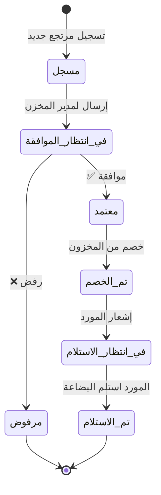

#### سيناريو إرجاع بضاعة للمورد

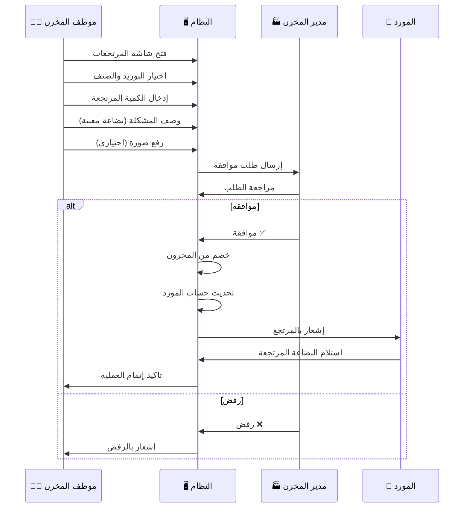

#### تأثير المرتجع على حساب المورد

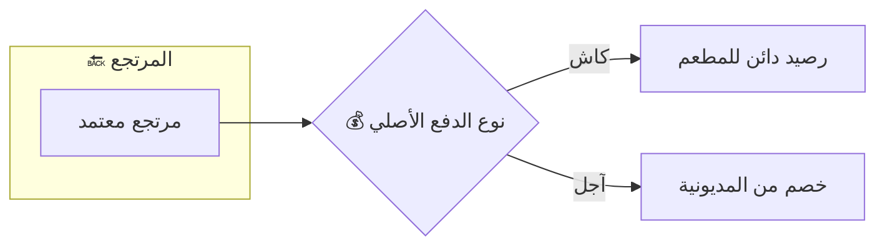

**الشرح:**

- لو التوريد كان كاش: المورد عليه رصيد دائن للمطعم (يترد أو يتخصم من توريد جديد)
- لو التوريد كان آجل: بيتخصم من المديونية المستحقة للمورد

---

## 🍳 الفروع (Branches)

### هيكل الفرع الواحد

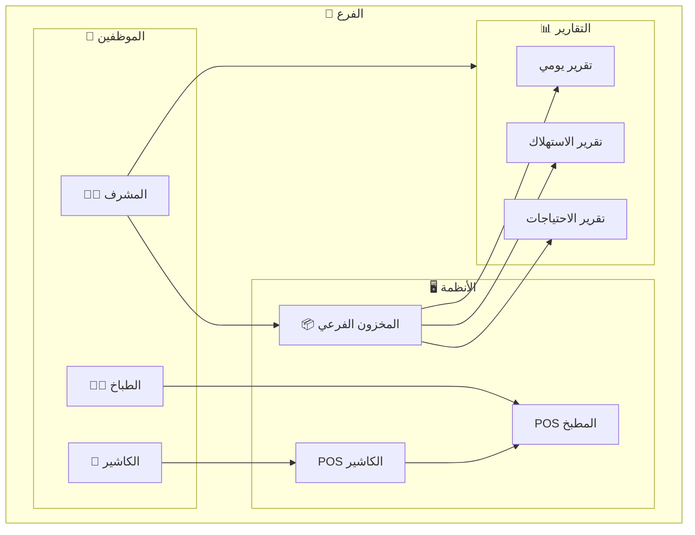

**الشرح:**
- كل فرع فيه 3 أدوار: مشرف + طباخ + كاشير
- المشرف مسؤول عن المخزون والتقارير
- الطباخ بيشتغل على POS المطبخ
- الكاشير بيشتغل على POS الكاشير
- الأوردرات بتروح من الكاشير للمطبخ

---

## 🛒 دورة حياة الأوردر (Order Lifecycle)

### من الزبون للطباخ

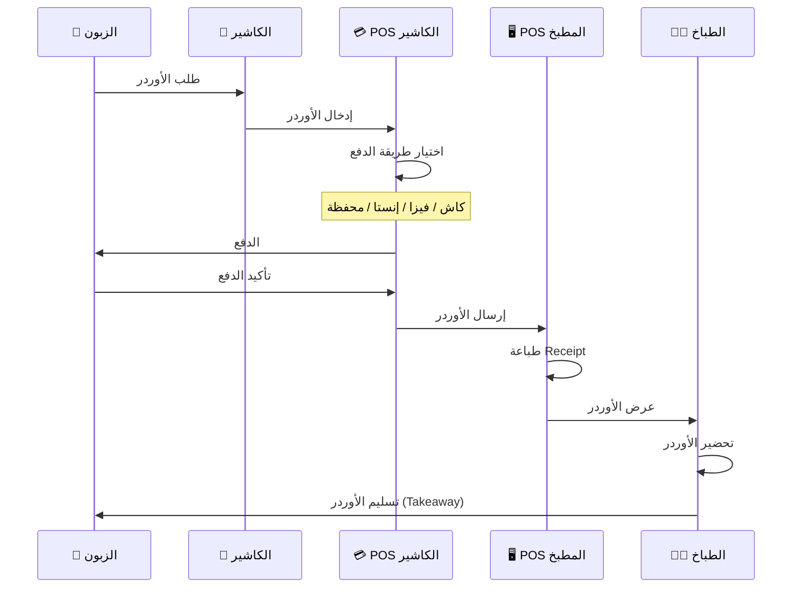

**الشرح:**
1. الزبون بيجي ويطلب من الكاشير
2. الكاشير بيدخل الأوردر في POS الكاشير
3. الزبون بيدفع (كاش/فيزا/إنستا/محفظة)
4. الأوردر بيتبعت لـ POS المطبخ
5. بيتطبع Receipt للطباخ
6. الطباخ بيحضر الأوردر
7. الزبون بياخد الأوردر (Takeaway)

### حالات الأوردر

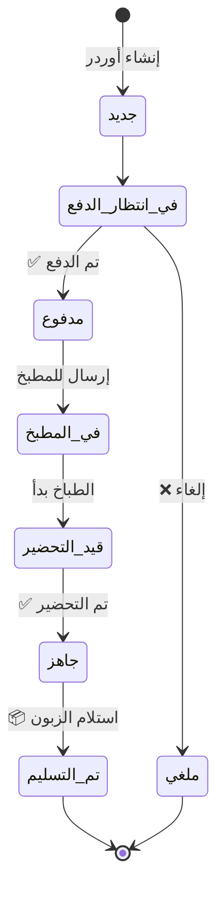

**الشرح:**
- الأوردر بيمر بـ 7 حالات محتملة
- من "جديد" لحد "تم التسليم"
- ممكن يتلغي في أي وقت قبل التحضير

---

## 💳 طرق الدفع (Payment Methods)

### أنواع الدفع المتاحة

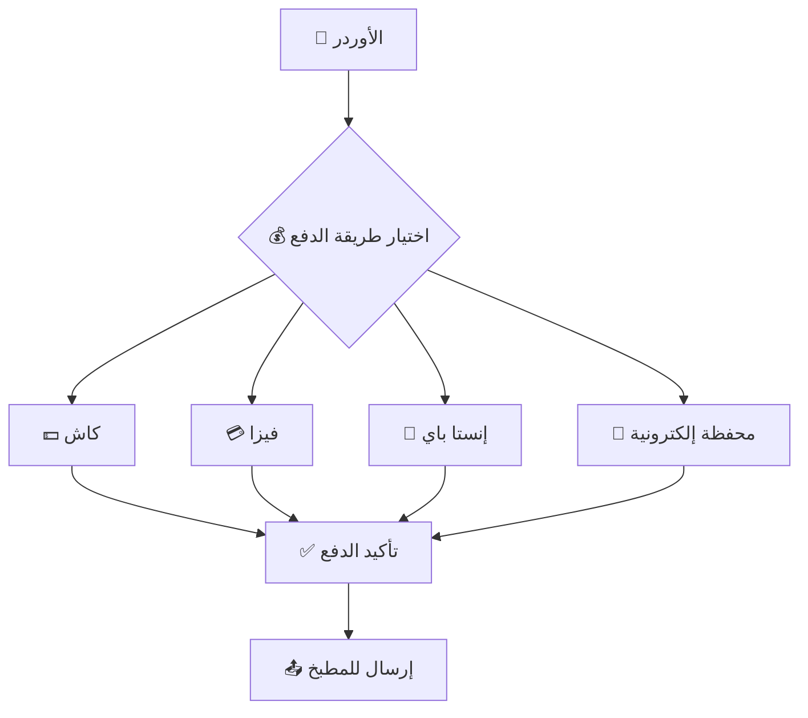

**الشرح:**
- 4 طرق دفع متاحة للزبون
- كل الطرق بتوصل لنفس النتيجة: تأكيد وإرسال للمطبخ
- النظام بيسجل طريقة الدفع لكل أوردر للتقارير

---

## 📦 تدفق المخزون (Inventory Flow)

### من المورد للفرع

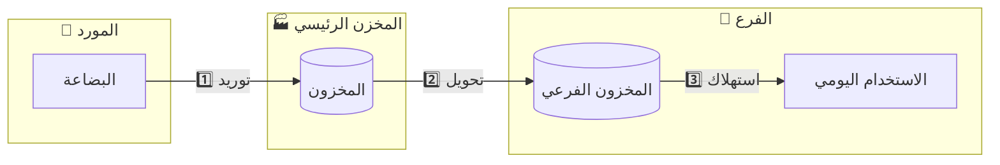

**الشرح:**
1. المورد بيورد للمخزن الرئيسي
2. المخزن الرئيسي بيحول للفروع
3. الفروع بتستهلك في التحضير اليومي

### عملية طلب المخزون من الفرع

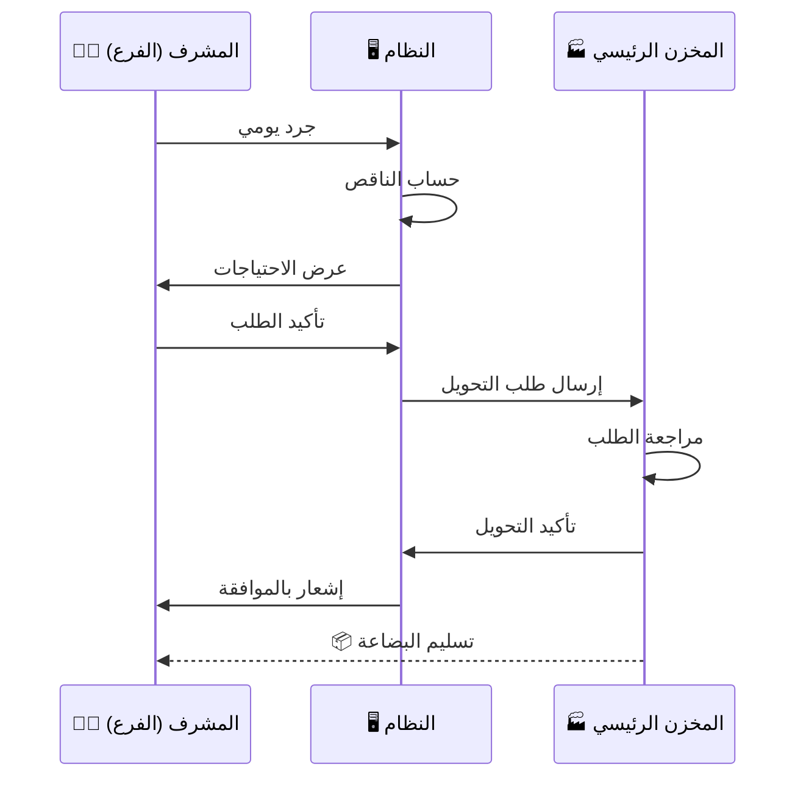

**الشرح:**
1. المشرف بيعمل جرد يومي
2. النظام بيحسب إيه الناقص
3. المشرف بيأكد الطلب
4. الطلب بيروح للمخزن الرئيسي
5. المخزن الرئيسي بيوافق ويحول البضاعة

---

## 📊 الجرد والتقارير (Inventory & Reports)

### أنواع التقارير

```mermaid
flowchart TB
    subgraph MAIN_REPORTS["📊 تقارير المخزن الرئيسي"]
        MR1["📦 تقرير المخزون الحالي"]
        MR2["🚚 تقرير التوريدات"]
        MR3["💰 تقرير المديونيات (آجل)"]
        MR4["📤 تقرير التحويلات للفروع"]
        MR5["📉 تقرير الأصناف الناقصة"]
        MR6["🗑️ تقرير التالف"]
        MR7["🔙 تقرير المرتجعات للموردين"]
    end
    
    subgraph BRANCH_REPORTS["📊 تقارير الفروع"]
        BR1["📦 تقرير المخزون الفرعي"]
        BR2["🍽️ تقرير المبيعات اليومية"]
        BR3["� تققرير الاستهلاك"]
        BR4["�  تقرير طرق الدفع"]
        BR5["📋 تقرير الأوردرات"]
        BR6["🗑️ تقرير التالف اليومي"]
    end
```

**الشرح:**

**تقارير المخزن الرئيسي:**
- المخزون الحالي: كل الأصناف وكمياتها
- التوريدات: كل التوريدات من الموردين
- المديونيات: الفلوس المستحقة للموردين (آجل)
- التحويلات: البضاعة المحولة للفروع
- الأصناف الناقصة: الأصناف تحت الحد الأدنى
- التالف: الأصناف التالفة وأسباب التلف والتكلفة
- المرتجعات للموردين: البضاعة المرتجعة للموردين وأسبابها

**تقارير الفروع:**
- المخزون الفرعي: الأصناف المتاحة في الفرع
- المبيعات اليومية: إجمالي المبيعات
- الاستهلاك: المكونات المستخدمة
- طرق الدفع: توزيع المبيعات حسب طريقة الدفع
- الأوردرات: تفاصيل كل الأوردرات
- التالف اليومي: الأصناف التالفة في الفرع

### دورة الجرد اليومي

```mermaid
flowchart TB
    START["🌅 بداية اليوم"] --> OPEN["فتح المخزون"]
    OPEN --> COUNT["📋 جرد أول اليوم"]
    COUNT --> WORK["🍳 العمل اليومي"]
    WORK --> CLOSE["📋 جرد آخر اليوم"]
    CLOSE --> CALC["🔢 حساب الاستهلاك"]
    CALC --> REPORT["📊 إنشاء التقرير"]
    REPORT --> NEED{"هل فيه نقص؟"}
    NEED -->|"نعم"| REQUEST["📝 طلب من المخزن الرئيسي"]
    NEED -->|"لا"| END["✅ انتهاء اليوم"]
    REQUEST --> END
```

**الشرح:**
1. أول اليوم: جرد المخزون الموجود
2. خلال اليوم: العمل والبيع
3. آخر اليوم: جرد تاني
4. حساب الفرق = الاستهلاك
5. لو فيه نقص: طلب من المخزن الرئيسي

---

## 👥 صلاحيات المستخدمين (User Permissions)

### الأدوار والصلاحيات

```mermaid
flowchart TB
    subgraph ROLES["👥 الأدوار"]
        ADMIN["🔑 مدير النظام"]
        WH_MANAGER["🏭 مدير المخزن الرئيسي"]
        BRANCH_SUP["👨‍💼 مشرف الفرع"]
        CHEF_ROLE["👨‍🍳 الطباخ"]
        CASHIER_ROLE["💁 الكاشير"]
    end
    
    subgraph PERMISSIONS["🔐 الصلاحيات"]
        P1["إدارة الموردين"]
        P2["إدارة المخزن الرئيسي"]
        P3["تحويل المخزون"]
        P4["جرد الفرع"]
        P5["إنشاء الأوردرات"]
        P6["عرض التقارير"]
        P7["استلام الأوردرات"]
    end
    
    ADMIN --> P1 & P2 & P3 & P4 & P5 & P6 & P7
    WH_MANAGER --> P1 & P2 & P3 & P6
    BRANCH_SUP --> P4 & P6
    CHEF_ROLE --> P7
    CASHIER_ROLE --> P5
```

**الشرح:**

| الدور | الصلاحيات |
|-------|----------|
| مدير النظام | كل الصلاحيات |
| مدير المخزن الرئيسي | الموردين + المخزن + التحويلات + التقارير |
| مشرف الفرع | الجرد + التقارير |
| الطباخ | استلام وتحضير الأوردرات |
| الكاشير | إنشاء الأوردرات والدفع |

---

## 🔄 السيناريوهات الرئيسية (Main Scenarios)

### السيناريو 1: توريد بضاعة جديدة

```mermaid
sequenceDiagram
    participant S as 🚚 المورد
    participant WH as 🏭 مدير المخزن
    participant SYS as 🖥️ النظام
    
    S->>WH: وصول البضاعة
    WH->>WH: فحص البضاعة
    alt البضاعة سليمة
        WH->>SYS: تسجيل التوريد
        SYS->>SYS: تحديث المخزون
        WH->>SYS: تحديد طريقة الدفع
        alt كاش
            SYS->>SYS: تسجيل دفع فوري
        else آجل
            SYS->>SYS: تسجيل مديونية
        end
        WH->>S: إيصال الاستلام
    else البضاعة تالفة
        WH->>S: رفض البضاعة
    end
```

### السيناريو 2: طلب زبون كامل

```mermaid
sequenceDiagram
    participant C as 🧑 الزبون
    participant CASH as 💁 الكاشير
    participant POS as 💳 POS
    participant KITCHEN as 🖥️ المطبخ
    participant CHEF as 👨‍🍳 الطباخ
    
    C->>CASH: أهلاً، عايز ساندويتش
    CASH->>POS: إدخال الأوردر
    POS->>C: المبلغ 50 جنيه
    C->>POS: دفع (فيزا)
    POS->>POS: تأكيد الدفع
    POS->>KITCHEN: إرسال الأوردر
    KITCHEN->>KITCHEN: طباعة Receipt
    KITCHEN->>CHEF: عرض الأوردر
    CHEF->>CHEF: تحضير الساندويتش
    CHEF->>C: اتفضل الأوردر
    C->>C: استلام (Takeaway)
```

### السيناريو 3: جرد يومي وطلب مخزون

```mermaid
sequenceDiagram
    participant SUP as 👨‍💼 المشرف
    participant SYS as 🖥️ النظام
    participant MAIN as 🏭 المخزن الرئيسي
    
    Note over SUP: نهاية اليوم
    SUP->>SYS: فتح شاشة الجرد
    SYS->>SUP: عرض الأصناف
    SUP->>SYS: إدخال الكميات الفعلية
    SYS->>SYS: حساب الاستهلاك
    SYS->>SYS: مقارنة بالحد الأدنى
    SYS->>SUP: عرض الأصناف الناقصة
    SUP->>SYS: تأكيد طلب التحويل
    SYS->>MAIN: إرسال الطلب
    MAIN->>SYS: الموافقة على الطلب
    SYS->>SUP: إشعار بالموافقة
```

### السيناريو 4: سداد مديونية مورد

```mermaid
sequenceDiagram
    participant WH as 🏭 مدير المخزن
    participant SYS as 🖥️ النظام
    participant S as 🚚 المورد
    
    WH->>SYS: فتح شاشة المديونيات
    SYS->>WH: عرض الموردين والمبالغ
    WH->>SYS: اختيار المورد
    SYS->>WH: عرض تفاصيل المديونية
    WH->>SYS: تسجيل سداد (كلي/جزئي)
    SYS->>SYS: تحديث المديونية
    SYS->>WH: إيصال السداد
    WH->>S: تسليم الإيصال
```

---

## 🗄️ هيكل البيانات المقترح (Data Structure)

### الجداول الرئيسية

```mermaid
erDiagram
    SUPPLIERS ||--o{ SUPPLIES : "يورد"
    SUPPLIES ||--|| PAYMENTS : "له"
    MAIN_WAREHOUSE ||--o{ INVENTORY_MAIN : "يحتوي"
    INVENTORY_MAIN ||--o{ TRANSFERS : "يحول"
    INVENTORY_MAIN ||--o{ DAMAGED_MAIN : "تالف"
    BRANCHES ||--o{ INVENTORY_BRANCH : "يحتوي"
    INVENTORY_BRANCH ||--o{ DAMAGED_BRANCH : "تالف"
    TRANSFERS }o--|| BRANCHES : "إلى"
    BRANCHES ||--o{ ORDERS : "يستقبل"
    ORDERS ||--o{ ORDER_ITEMS : "يحتوي"
    ORDERS ||--|| PAYMENTS_ORDERS : "له"
    USERS ||--o{ ORDERS : "ينشئ"
    USERS ||--o{ DAMAGED_MAIN : "يسجل"
    USERS ||--o{ DAMAGED_BRANCH : "يسجل"
    USERS }o--|| ROLES : "له"
    DAMAGE_REASONS ||--o{ DAMAGED_MAIN : "سبب"
    DAMAGE_REASONS ||--o{ DAMAGED_BRANCH : "سبب"
    SUPPLIES ||--o{ SUPPLIER_RETURNS : "مرتجع"
    SUPPLIERS ||--o{ SUPPLIER_RETURNS : "إلى"
    USERS ||--o{ SUPPLIER_RETURNS : "يسجل"
```

**الشرح:**
- **SUPPLIERS**: بيانات الموردين
- **SUPPLIES**: التوريدات
- **PAYMENTS**: مدفوعات الموردين (كاش/آجل)
- **MAIN_WAREHOUSE**: المخزن الرئيسي
- **INVENTORY_MAIN**: أصناف المخزن الرئيسي
- **BRANCHES**: الفروع
- **INVENTORY_BRANCH**: مخزون كل فرع
- **TRANSFERS**: تحويلات المخزون
- **ORDERS**: الأوردرات
- **ORDER_ITEMS**: تفاصيل الأوردر
- **PAYMENTS_ORDERS**: مدفوعات الأوردرات
- **USERS**: المستخدمين
- **ROLES**: الأدوار والصلاحيات
- **DAMAGED_MAIN**: سجل التالف في المخزن الرئيسي
- **DAMAGED_BRANCH**: سجل التالف في الفروع
- **DAMAGE_REASONS**: أسباب التلف (انتهاء صلاحية، سوء تخزين، إلخ)
- **SUPPLIER_RETURNS**: مرتجعات الموردين (البضاعة المعيبة)

---

## 📱 شاشات النظام المقترحة (System Screens)

### خريطة الشاشات

```mermaid
flowchart TB
    subgraph LOGIN["🔐 تسجيل الدخول"]
        L1["شاشة الدخول"]
    end
    
    subgraph MAIN_MENU["📋 القائمة الرئيسية"]
        M1["لوحة التحكم"]
    end
    
    subgraph SUPPLIERS_MODULE["🚚 وحدة الموردين"]
        S1["قائمة الموردين"]
        S2["إضافة مورد"]
        S3["التوريدات"]
        S4["المديونيات"]
        S5["🔙 المرتجعات"]
    end
    
    subgraph WAREHOUSE_MODULE["🏭 وحدة المخزن الرئيسي"]
        W1["المخزون"]
        W2["الجرد"]
        W3["التحويلات"]
        W4["التقارير"]
        W5["🗑️ التالف"]
    end
    
    subgraph BRANCH_MODULE["🍳 وحدة الفرع"]
        B1["المخزون الفرعي"]
        B2["الجرد اليومي"]
        B3["طلب مخزون"]
        B4["التقارير"]
        B5["🗑️ التالف"]
    end
    
    subgraph POS_MODULE["💳 وحدة POS"]
        P1["POS الكاشير"]
        P2["POS المطبخ"]
    end
    
    L1 --> M1
    M1 --> SUPPLIERS_MODULE
    M1 --> WAREHOUSE_MODULE
    M1 --> BRANCH_MODULE
    M1 --> POS_MODULE
```

---

## ✅ ملخص النظام (System Summary)

| العنصر | الوصف |
|--------|-------|
| **الفروع** | مخزن رئيسي + فرعين للبيع |
| **الموردين** | نظام منفصل مرتبط بالمخزن الرئيسي |
| **طرق الدفع للموردين** | كاش / آجل |
| **طرق الدفع للزبائن** | كاش / فيزا / إنستا باي / محفظة |
| **نوع الأوردرات** | Takeaway فقط |
| **نظام POS** | 2 لكل فرع (كاشير + مطبخ) |
| **الجرد** | يومي في الفروع + دوري في المخزن الرئيسي |
| **التنبيهات** | عند نقص المخزون عن الحد الأدنى |
| **طلب المخزون** | من النظام بناءً على الجرد اليومي |
| **نظام التالف** | تسجيل الأصناف التالفة مع السبب والكمية (يحتاج موافقة المدير) |
| **مرتجعات الموردين** | إرجاع البضاعة المعيبة للمورد (يحتاج موافقة مدير المخزن) |

---

## 🚀 الخطوات التالية المقترحة

1. **تصميم قاعدة البيانات** بناءً على هيكل البيانات المقترح
2. **تصميم واجهات المستخدم (UI/UX)** للشاشات المختلفة
3. **تحديد التقنيات** المستخدمة (Frontend/Backend/Database)
4. **البدء في التطوير** حسب الأولويات

---

> 📝 **ملاحظة:** هذا التقرير يمثل فهم أولي للنظام ويمكن تعديله وإضافة تفاصيل أكثر حسب الحاجة.
